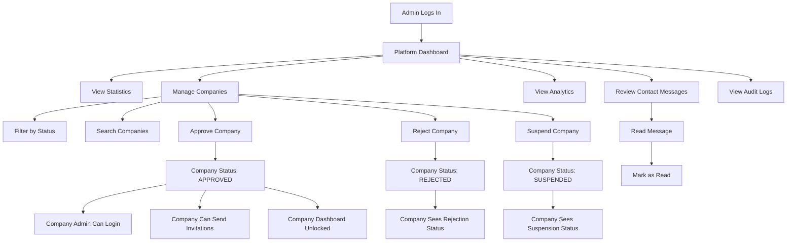
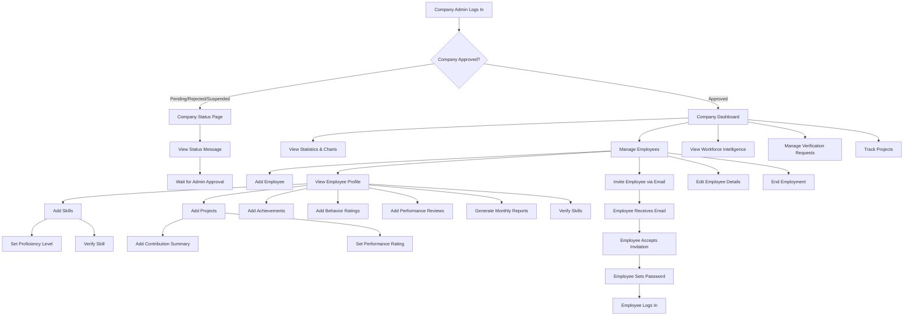
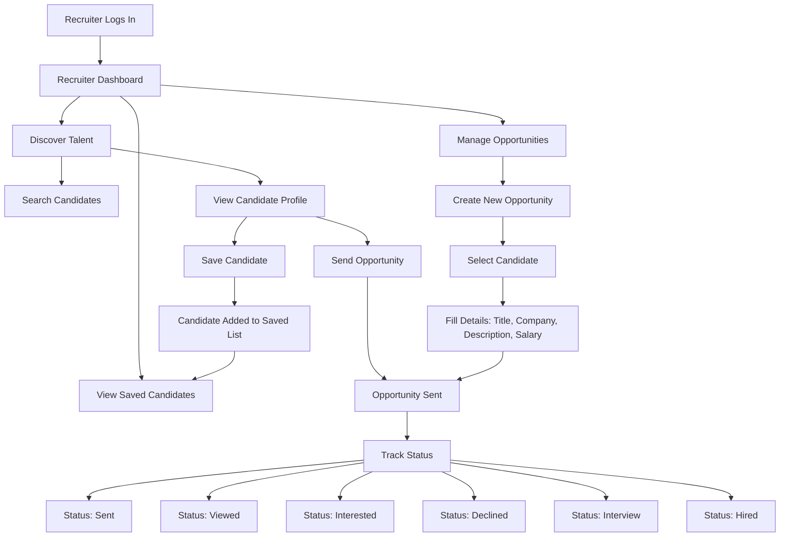
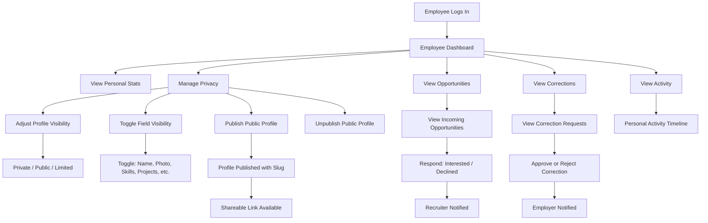

# WorkProof Project Documentation

---

## 1. Cover Page

| Field | Details |
|-------|---------|
| **Project Name** | WorkProof |
| **Version** | 1.0.0 |
| **Type** | Web Application — Verified Professional Records Platform |
| **Frontend** | React 18 + Vite 5 + Tailwind CSS 3 |
| **Backend** | Express.js (Node.js) |
| **Database** | MySQL 5.7+ / MariaDB 10.3+ |
| **Authentication** | JWT-based HTTP-only cookies |
| **API Style** | RESTful JSON API |
| **Status** | Production-ready with demo seed data |

---

## 2. Table of Contents

1. [Cover Page](#1-cover-page)
2. [Table of Contents](#2-table-of-contents)
3. [Project Overview](#3-project-overview)
4. [Project Objectives](#4-project-objectives)
5. [Problem Statement](#5-problem-statement)
6. [Target Users](#6-target-users)
7. [User Roles](#7-user-roles)
   - 7.1 [Platform Admin](#71-platform-admin)
   - 7.2 [Company Admin](#72-company-admin)
   - 7.3 [Recruiter](#73-recruiter)
   - 7.4 [Employee](#74-employee)
8. [Login Credentials](#8-login-credentials)
9. [Dashboard Overview](#9-dashboard-overview)
   - 9.1 [Platform Admin Dashboard](#91-platform-admin-dashboard)
   - 9.2 [Company Admin Dashboard](#92-company-admin-dashboard)
   - 9.3 [Recruiter Dashboard](#93-recruiter-dashboard)
   - 9.4 [Employee Dashboard](#94-employee-dashboard)
10. [Features & Functionalities](#10-features--functionalities)
11. [User Workflows](#11-user-workflows)
    - 11.1 [Platform Admin Workflow](#111-platform-admin-workflow)
    - 11.2 [Company Admin Workflow](#112-company-admin-workflow)
    - 11.3 [Recruiter Workflow](#113-recruiter-workflow)
    - 11.4 [Employee Workflow](#114-employee-workflow)
12. [Conclusion](#12-conclusion)

---

## 3. Project Overview

WorkProof is a web-based platform that creates trusted, verified professional records for employees. The system replaces traditional self-reported CVs with records that are validated by the companies people have actually worked for. It serves four distinct user roles — Platform Administrators, Company Administrators, Employees, and Recruiters — each with a dedicated interface and purpose-built functionality.

The platform is built on a modern technology stack:

- **Frontend**: React 18 with Vite 5 as the build tool, React Router v6 for client-side routing, Tailwind CSS 3 for utility-first styling, Framer Motion for animations, Recharts for data visualization, and Lucide React for icons. State management uses React Context API with a useReducer pattern, and all API calls go through Axios with `withCredentials: true` for cookie-based authentication.

- **Backend**: Express.js REST API with JWT-based authentication stored in HTTP-only cookies. The backend enforces role-based access control (RBAC) and tenant-level data isolation, ensuring that companies can only access their own employee data. A middleware pipeline handles CORS, security headers, session attachment, and error handling.

- **Database**: MySQL relational database with a normalized schema covering users, companies, employees, skills, projects, achievements, performance reviews, behavior ratings, monthly progress reports, privacy settings, public profiles, recruiter interactions, notifications, audit logs, and subscription management (schema-ready).

The application supports a demo mode with pre-seeded data for all four roles, making it immediately testable without manual setup. A guided demo overlay walks first-time users through the platform's key features.

---

## 4. Project Objectives

The primary objectives of the WorkProof platform are:

1. **Replace Self-Reported Credentials**: Eliminate the reliance on unverified, self-reported CVs by creating a system where professional records are validated by employers.

2. **Establish a Trust Layer**: Build a centralized, tamper-proof source of truth for professional reputations that all stakeholders (companies, employees, recruiters) can rely on.

3. **Empower Employee Ownership**: Give employees control over their verified career data, including the ability to choose what information is shared publicly and when.

4. **Streamline Talent Discovery**: Provide recruiters with access to verified candidate data, enabling confident, data-backed hiring decisions.

5. **Enable Workforce Intelligence**: Give company administrators deep insights into their workforce through verified skill data, performance analytics, and growth potential tracking.

6. **Maintain Privacy by Default**: Ensure that all employee data remains private within the organization unless the employee explicitly chooses to make it public.

---

## 5. Problem Statement

Traditional hiring and professional credentialing suffer from a fundamental trust deficit:

- **CVs are self-reported** and can be embellished or falsified with no easy way for employers to verify claims.
- **Skills assessments are inconsistent** and often rely on proxy measures rather than actual demonstrated work.
- **Reference checks are time-consuming** and provide limited, often subjective information.
- **Employees lack ownership** of their professional records, which are scattered across multiple employers and platforms.
- **Recruiters lack reliable data** to make informed hiring decisions, leading to mismatches and wasted resources.

WorkProof addresses these problems by creating a platform where employers validate the skills, projects, and contributions of their employees in real-time, building a verifiable, portable professional record that follows the employee throughout their career. The subscription-based billing model ensures the platform remains sustainable, with a 30-day free trial allowing companies to evaluate the service before committing. The subscription is only required after admin approval and trial completion, not immediately upon registration.

---

## 6. Target Users

WorkProof serves four distinct user categories:

| User Category | Description | Primary Need |
|---------------|-------------|--------------|
| **Companies** | Organizations of all sizes that employ professionals | Verify workforce skills, track performance, manage employee records |
| **Employees** | Professionals working at companies on the platform | Own and control their verified career profile |
| **Recruiters** | Talent acquisition professionals and agencies | Discover verified candidates for hiring opportunities |
| **Platform Administrators** | WorkProof internal team | Manage the platform, approve companies, monitor analytics |

---

## 7. User Roles

The platform implements four distinct user roles, each with specific permissions, routes, and functionality. The role is assigned at registration and enforced on both the frontend (route guards) and backend (middleware guards).

### 7.1 Platform Admin

**Role Identifier**: `platform_admin`

**Purpose**: Platform Administrators oversee the entire WorkProof ecosystem. They manage company registrations, monitor platform analytics, review audit logs, and handle incoming contact messages from users.

**Routes Accessible**:
- `/admin/dashboard` — Full platform overview with statistics and company management
- `/admin/companies` — Focused company management view with table and actions
- `/admin/messages` — Contact inbox for messages submitted via the Contact page
- `/admin/activity` — Platform-wide activity feed

**Backend API Permissions**:
- `GET /api/admin/dashboard` — Dashboard statistics
- `GET /api/admin/companies` — List all companies (with pending filter)
- `GET /api/admin/companies/pending` — List pending companies
- `POST /api/admin/companies/:id/approve` — Approve a company registration
- `POST /api/admin/companies/:id/reject` — Reject a company registration
- `POST /api/admin/companies/:id/suspend` — Suspend a company
- `GET /api/admin/analytics` — Platform analytics data
- `GET /api/admin/audit-logs` — Audit log entries

**Key Capabilities**:
- View platform-wide statistics (total companies, employees, users)
- Approve, reject, or suspend company registrations
- Search and filter companies by status
- View platform analytics and audit logs
- Read and manage contact messages from users
- Bypass tenant isolation checks (cross-company visibility)

### 7.2 Company Admin

**Role Identifier**: `company_admin`

**Purpose**: Company Administrators manage their organization's presence on WorkProof. They invite employees, verify skills and projects, track performance, generate reports, and manage workforce data.

**Routes Accessible**:
- `/company/dashboard` — Company overview with charts and statistics
- `/company/employees` — Employee list and management
- `/company/employee/:employeeId` — Individual employee profile with full details
- `/company/workforce-intelligence` — Advanced workforce analytics
- `/company/verification` — Verification request management
- `/company/projects` — Internal project tracking
- `/company/activity` — Company activity feed
- `/company/status` — Company registration status (for pending/rejected companies)

**Backend API Permissions**:
- `GET /api/company/dashboard` — Dashboard statistics (employee count, department distribution, skills overview, activity)
- `GET/POST /api/company/employees` — List and create employees
- `GET/PUT/DELETE /api/company/employees/:id` — Employee detail, update, and deletion
- `POST /api/company/employees/:id/skills` — Add skills to an employee
- `PUT /api/company/employees/:id/skills/:skillId` — Update or verify skills
- `POST /api/company/employees/:id/projects` — Add projects to an employee
- `PUT /api/company/employees/:id/projects/:projectId` — Update projects
- `POST /api/company/employees/:id/achievements` — Add achievements
- `POST /api/company/employees/:id/behavior` — Add behavior ratings
- `POST /api/company/employees/:id/performance-review` — Add performance reviews
- `POST /api/company/employees/:id/monthly-report` — Generate monthly reports
- `GET /api/company/employees/:id/reports` — Retrieve employee reports
- `POST /api/company/employees/:id/verify-skill` — Verify a specific skill
- `POST /api/company/employees/:id/end-employment` — End employment record
- `POST /api/company/invitations` — Send employee invitations
- `POST /api/company/correction/request` — Request corrections on employee records

**Key Capabilities**:
- Full employee lifecycle management (add, update, soft-delete)
- Invite employees via email with token-based acceptance
- Add and verify skills with proficiency levels
- Track projects with contribution summaries and performance ratings
- Record achievements (certifications, awards, publications)
- Conduct behavior ratings across 7 categories (collaboration, communication, reliability, leadership, problem-solving, adaptability, professional growth)
- Create performance reviews with ratings, strengths, and areas for improvement
- Generate monthly progress reports with AI-generated insights
- End employment records and transfer profile ownership to employees
- View workforce intelligence with advanced analytics
- All operations enforce tenant isolation (company data is invisible to other companies)

### 7.3 Recruiter

**Role Identifier**: `recruiter`

**Purpose**: Recruiters discover and engage with verified talent on the platform. They can search for candidates, save profiles, and send job opportunities to employees who have chosen to make their profiles public.

**Routes Accessible**:
- `/recruiter/dashboard` — Recruiter overview with statistics
- `/recruiter/talent` — Talent discovery and search
- `/recruiter/candidate/:candidateId` — Individual candidate profile view
- `/recruiter/saved` — Saved candidates list
- `/recruiter/opportunities` — Job opportunities management

**Backend API Permissions**:
- `GET /api/recruiter/talent` — Search and discover talent
- `GET /api/recruiter/candidates/:id` — View candidate details
- `GET/POST/DELETE /api/recruiter/save-candidate` — Save/unsave candidates
- `GET/POST /api/recruiter/opportunities` — List and create job opportunities

**Key Capabilities**:
- Discover verified talent with public profiles
- View detailed candidate profiles including skills, projects, and experience
- Save candidates for future reference
- Send job opportunities to candidates with status tracking
- Track opportunity status (sent, viewed, interested, declined, interview, hired)
- Match percentage indicator for candidate-fit assessment

### 7.4 Employee

**Role Identifier**: `employee`

**Purpose**: Employees own their verified career profiles. They can view their dashboard, manage privacy settings, publish public profiles, respond to correction requests, and review job opportunities from recruiters.

**Routes Accessible**:
- `/employee/dashboard` — Employee overview with personal statistics
- `/employee/privacy` — Privacy controls for profile visibility
- `/employee/opportunities` — Job opportunities from recruiters
- `/employee/activity` — Personal activity feed

**Backend API Permissions**:
- `GET /api/employee/dashboard` — Personal dashboard with statistics
- `GET /api/employee/reports` — View personal reports
- `GET /api/employee/progress` — View personal progress data
- `GET/PUT /api/employee/privacy` — Manage privacy settings
- `POST /api/employee/profile/publish` — Publish public profile
- `POST /api/employee/profile/unpublish` — Unpublish public profile
- `GET /api/employee/profile/public` — View public profile data
- `GET /api/employee/corrections` — View correction requests
- `POST /api/employee/corrections/:id/respond` — Respond to correction requests
- `GET /api/employee/opportunities` — View job opportunities
- `PUT /api/employee/opportunities/:id/respond` — Respond to opportunities

**Key Capabilities**:
- View personal dashboard with skills, projects, and progress data
- Control profile visibility with granular privacy toggles (name, photo, skills, projects, achievements, experience, performance summary, etc.)
- Publish or unpublish a public profile with a unique slug
- View and respond to correction requests from employers
- Receive and respond to job opportunities from recruiters
- Track employment history and verified records

---

## 8. Login Credentials

The following demo accounts are pre-seeded in the database and available for testing all platform features. These credentials are generated by the `server/scripts/seed.php` script.

| Role | Email | Password |
|------|-------|----------|
| **Platform Admin** | `admin@workproof.demo` | `DemoAdmin123!` |
| **Company Admin** | `company@workproof.demo` | `DemoCompany123!` |
| **Employee** | `employee@workproof.demo` | `DemoEmployee123!` |
| **Recruiter** | `recruiter@workproof.demo` | `DemoRecruiter123!` |
| **Second Company Admin** | `orbit@workproof.demo` | `DemoOrbit123!` |

**Notes**:
- The `company@workproof.demo` account belongs to **NovaTech Solutions** (pre-approved for demo).
- The `orbit@workproof.demo` account belongs to **Orbit Labs** (second tenant for isolation testing).
- The `employee@workproof.demo` account is employed at NovaTech Solutions.
- Accounts are available after running the seed script against the database.

---

## 9. Dashboard Overview

Each user role is presented with a purpose-built dashboard upon login. The dashboards are route-protected on both the frontend and backend.

### 9.1 Platform Admin Dashboard

**Route**: `/admin/dashboard`

The Platform Admin Dashboard provides a comprehensive view of the entire WorkProof platform. It serves two modes depending on the route:

- **Full Dashboard** (`/admin/dashboard`): Displays platform-wide statistics, company management table, and a contact inbox for user messages.
- **Companies View** (`/admin/companies`): A focused view showing only the company management table with search, filter, and action capabilities.

**Key Components**:
- **Statistics Cards**: Total companies, pending approvals, active companies, total employees
- **Company Management Table**: Searchable, filterable list of all registered companies with columns for name, industry, country, registration date, and status
- **Status Filters**: ALL, PENDING, APPROVED, REJECTED, SUSPENDED
- **Action Buttons**: Approve, Reject, Suspend for each company with confirmation dialogs
- **Contact Inbox**: Messages submitted via the public Contact Us page, displayed with read/unread status
- **Activity Feed**: Recent platform-wide activities

**Backend API Endpoints**:
```
GET /api/admin/dashboard          → Dashboard statistics
GET /api/admin/companies          → List all companies
GET /api/admin/companies/pending  → List pending companies
POST /api/admin/companies/:id/approve  → Approve company
POST /api/admin/companies/:id/reject   → Reject company
POST /api/admin/companies/:id/suspend  → Suspend company
GET /api/admin/analytics          → Platform analytics
GET /api/admin/audit-logs         → Audit log entries
```

### 9.2 Company Admin Dashboard

**Route**: `/company/dashboard`

The Company Admin Dashboard gives company administrators a complete overview of their workforce. It displays key metrics, charts, and an activity feed.

**Key Components**:
- **Statistics Cards**: Total employees, verified employees, active projects, departments count
- **Employee Distribution Chart**: Bar chart showing employee count by department
- **Skills Coverage Chart**: Pie chart showing skills distribution across the workforce
- **Performance Trends Chart**: Line chart showing performance trends over time
- **Recent Activity Feed**: Timeline of recent actions within the company
- **Quick Actions**: Add employee, send invitation, view all employees

**Backend API Endpoints**:
```
GET /api/company/dashboard              → Dashboard data
GET /api/company/employees              → List employees
POST /api/company/employees             → Create employee
GET /api/company/employees/:id          → Employee detail
PUT /api/company/employees/:id          → Update employee
DELETE /api/company/employees/:id       → Soft delete employee
POST /api/company/employees/:id/skills  → Add skill
PUT /api/company/employees/:id/skills/:skillId  → Update/verify skill
POST /api/company/employees/:id/projects       → Add project
PUT /api/company/employees/:id/projects/:projectId  → Update project
POST /api/company/employees/:id/achievements    → Add achievement
POST /api/company/employees/:id/behavior        → Add behavior rating
POST /api/company/employees/:id/performance-review  → Add performance review
POST /api/company/employees/:id/monthly-report  → Generate monthly report
GET /api/company/employees/:id/reports          → Get employee reports
POST /api/company/employees/:id/verify-skill    → Verify skill
POST /api/company/employees/:id/end-employment  → End employment
POST /api/company/invitations                   → Send invitation
POST /api/company/correction/request            → Request correction
```

### 9.3 Recruiter Dashboard

**Route**: `/recruiter/dashboard`

The Recruiter Dashboard provides tools for discovering and engaging with verified talent. It serves as the central hub for recruitment activities.

**Key Components**:
- **Statistics Cards**: Saved candidates, active opportunities, discovery count, match percentage
- **Talent Discovery**: Search and filter through verified employee profiles
- **Saved Candidates**: List of bookmarked candidates with notes
- **Opportunity Management**: Create and track job opportunities sent to candidates
- **Candidate Profile View**: Detailed view of a candidate's skills, projects, and experience

**Backend API Endpoints**:
```
GET /api/recruiter/talent                → Discover talent
GET /api/recruiter/candidates/:id        → View candidate
GET /api/recruiter/save-candidate        → List saved candidates
POST /api/recruiter/save-candidate       → Save candidate
DELETE /api/recruiter/save-candidate/:id → Remove saved candidate
GET /api/recruiter/opportunities         → List opportunities
POST /api/recruiter/opportunities        → Create opportunity
```

### 9.4 Employee Dashboard

**Route**: `/employee/dashboard`

The Employee Dashboard gives employees a personal view of their verified career profile, skills, projects, and progress.

**Key Components**:
- **Personal Statistics**: Skills count, verified skills, projects, achievements
- **Skills Overview**: List of skills with proficiency levels and verification status
- **Project History**: Timeline of projects with descriptions and contributions
- **Progress Tracking**: Monthly progress and growth indicators
- **Privacy Status**: Current profile visibility status with quick access to privacy controls
- **Opportunities**: Incoming job opportunities from recruiters

**Backend API Endpoints**:
```
GET /api/employee/dashboard         → Dashboard data
GET /api/employee/reports           → Personal reports
GET /api/employee/progress          → Progress data
GET /api/employee/privacy           → Privacy settings
PUT /api/employee/privacy           → Update privacy settings
POST /api/employee/profile/publish  → Publish public profile
POST /api/employee/profile/unpublish → Unpublish public profile
GET /api/employee/profile/public    → View public profile
GET /api/employee/corrections       → View correction requests
POST /api/employee/corrections/:id/respond → Respond to correction
GET /api/employee/opportunities     → View opportunities
PUT /api/employee/opportunities/:id/respond → Respond to opportunity
```

---

## 10. Features & Functionalities

The following table catalogs all implemented features across the platform, organized by domain.

### Authentication & Security

| Feature | Description | Implementation |
|---------|-------------|----------------|
| JWT-based Authentication | Secure login with HTTP-only cookies | `server/middleware/auth.js` — JWT signed with secret, stored in httpOnly cookie |
| Role-Based Access Control | Four roles with granular permissions | `requireRole()` middleware + frontend `ProtectedRoute` component |
| Tenant Isolation | Companies can only access their own data | `assertTenantAccess()` middleware checks company ID |
| Session Management | 7-day session expiry, secure cookies | Cookie maxAge: 7 days, SameSite, Secure in production |
| Input Validation | Server-side validation on all endpoints | `ApiError` utility for structured error responses |
| Audit Logging | All sensitive actions recorded | `audit_logs` table with user, role, action, entity, IP, user agent |
| Password Security | bcrypt hashing for all passwords | `password_hash()` in seed script |

### Landing & Public Pages

| Feature | Description | Implementation |
|---------|-------------|----------------|
| Landing Page | Hero, About, Features, How It Works sections | `src/pages/landing/LandingPage.jsx` |
| Pricing Page | Three pricing tiers with billing options | `src/pages/landing/PricingPage.jsx` + `src/config/pricing.js` |
| Contact Page | Message submission form for users | `src/pages/landing/ContactPage.jsx` |
| Public Profile | Shareable employee profile by slug | `GET /api/profile/:slug` — no auth required |
| Login Page | Authentication form | `src/pages/auth/LoginPage.jsx` |
| Registration Page | Company registration form | `src/pages/auth/CompanyRegistration.jsx` |
| Demo Login | Quick demo access with pre-seeded accounts | `src/pages/auth/DemoLoginPage.jsx` |

### Company Management

| Feature | Description | Implementation |
|---------|-------------|----------------|
| Company Registration | New companies register with details | `POST /api/companies/register` |
| Approval Workflow | Admin reviews and approves/rejects/suspends | `POST /api/admin/companies/:id/:action` |
| Company Status Page | Pending/rejected/suspended companies see status | `src/pages/company/CompanyStatus.jsx` |
| Employee Invitations | Invite employees via email with token | `POST /api/company/invitations` + `GET /api/company/invitations/verify` |
| Invitation Acceptance | New employees accept invite and set password | `POST /api/company/invitations/accept` |

### Employee Records

| Feature | Description | Implementation |
|---------|-------------|----------------|
| Employee CRUD | Create, read, update, soft-delete employees | `POST/GET/PUT/DELETE /api/company/employees/:id` |
| Skills Management | Add, update, verify skills with proficiency levels | `POST /api/company/employees/:id/skills`, `PUT /api/company/employees/:id/skills/:skillId` |
| Project Tracking | Add projects with role, technologies, contributions | `POST /api/company/employees/:id/projects` |
| Achievements | Certifications, awards, publications tracking | `POST /api/company/employees/:id/achievements` |
| Behavior Ratings | 7-category behavior assessment (1-5 scale) | `POST /api/company/employees/:id/behavior` |
| Performance Reviews | Periodic reviews with ratings, strengths, improvements | `POST /api/company/employees/:id/performance-review` |
| Monthly Reports | AI-generated monthly progress reports | `POST /api/company/employees/:id/monthly-report` |
| Skill Verification | Verify individual skills with reviewer tracking | `POST /api/company/employees/:id/verify-skill` |
| Employment End | End employment, transfer profile ownership | `POST /api/company/employees/:id/end-employment` |
| Correction Requests | Request corrections to employee records | `POST /api/company/correction/request` |

### Privacy & Public Profiles

| Feature | Description | Implementation |
|---------|-------------|----------------|
| Privacy Settings | Granular control over profile visibility | `src/pages/employee/PrivacyControls.jsx` |
| Field-level Privacy | Toggle visibility for name, photo, skills, projects, etc. | `privacy_settings` table with 15+ boolean fields |
| Public Profile | Employee can publish a shareable profile | `POST /api/employee/profile/publish` |
| Profile Slug | Unique URL slug for public profile | `public_profiles` table with slug index |
| View Tracking | Profile view count and last viewed timestamp | `public_profiles.view_count` and `last_viewed_at` |

### Recruiter Tools

| Feature | Description | Implementation |
|---------|-------------|----------------|
| Talent Discovery | Search through verified employee profiles | `GET /api/recruiter/talent` |
| Candidate Viewing | Detailed view of candidate's profile | `GET /api/recruiter/candidates/:id` |
| Saved Candidates | Bookmark candidates for future reference | `POST/GET/DELETE /api/recruiter/save-candidate` |
| Job Opportunities | Send opportunities with status tracking | `POST/GET /api/recruiter/opportunities` |
| Opportunity Status | Track: sent, viewed, interested, declined, interview, hired | `job_opportunities.status` enum |

### Notifications & Activity

| Feature | Description | Implementation |
|---------|-------------|----------------|
| Notification System | User-specific notifications with read/unread status | `GET /api/notifications`, `PUT /api/notifications/:id/read` |
| Mark All Read | Bulk mark all notifications as read | `PUT /api/notifications/read-all` |
| Activity Feed | Recent activities across the platform | `activities` array in global state |
| Contact Messages | User-submitted messages to platform admin | `SUBMIT_CONTACT_MESSAGE` reducer action |
| Live Sync | Cross-tab contact message synchronization | `localStorage` event listeners in `AppProvider` |

### Guided Demo

| Feature | Description | Implementation |
|---------|-------------|----------------|
| Demo Overlay | Step-by-step walkthrough of the platform | `src/components/demo/GuidedDemo.jsx` |
| Demo Control Center | Control panel for the demo experience | `src/components/demo/DemoControlCenter.jsx` |
| 8-step Walkthrough | Covers key features across all roles | 8 steps in guided demo reducer |

### Database Schema

The database contains the following tables:

| Table | Purpose | Key Columns |
|-------|---------|-------------|
| `users` | Platform-wide user accounts | id, email, password_hash, role, company_id, employee_id |
| `companies` | Tenant organizations | id, name, status, admin_id, subscription_tier, employee_limit |
| `company_memberships` | User-company relationships | user_id, company_id, role |
| `employees` | Company employees with verification | id, company_id, job_title, department, employment_status, is_verified |
| `employee_invitations` | Email invitation tokens | id, company_id, email, token_hash, status |
| `skills` | Global skill catalog | id, name, category |
| `employee_skills` | Employee skill assignments | id, employee_id, skill_id, proficiency_level, is_verified |
| `projects` | Employee projects | id, employee_id, company_id, name, role, status, is_verified |
| `employee_behavior_ratings` | Behavior assessments | id, employee_id, category, rating, reviewer_id |
| `achievements` | Employee achievements | id, employee_id, title, category, is_verified |
| `performance_reviews` | Periodic performance evaluations | id, employee_id, rating, comments, strengths, areas_for_improvement |
| `monthly_progress_reports` | AI-generated monthly reports | id, employee_id, performance_score, behavior_score, skills_improved, growth_percentage |
| `privacy_settings` | Employee privacy controls | id, employee_id, profile_visibility, 15+ boolean visibility fields |
| `public_profiles` | Published employee profiles | id, employee_id, slug, is_public, view_count |
| `verification_corrections` | Correction/dispute records | id, employee_id, field_name, old_value, new_value, status |
| `saved_candidates` | Recruiter candidate bookmarks | id, recruiter_id, employee_id, notes |
| `job_opportunities` | Recruiter job offers | id, recruiter_id, employee_id, title, company_name, status |
| `notifications` | User notifications | id, user_id, type, title, message, is_read |
| `audit_logs` | Security audit trail | id, user_id, role, action, entity_type, entity_id, details, ip_address |
| `subscription_plans` | Subscription plan definitions | id, code, name, price_monthly, employee_limit, features |
| `company_subscriptions` | Company subscription records | id, company_id, plan_id, status, current_period_end |

---

## 11. User Workflows

### 11.1 Platform Admin Workflow



**Step-by-step**:

1. The Platform Admin logs in using their credentials at `/login`.
2. The system authenticates via the backend (`POST /api/auth/login`) and issues a JWT cookie.
3. Based on the `platform_admin` role, the user is redirected to `/admin/dashboard`.
4. The dashboard displays key statistics: total companies, pending approvals, active companies, and total employees.
5. The admin can view all registered companies in a searchable, filterable table.
6. Companies with `PENDING` status require admin action:
   - **Approve**: Sets company status to `APPROVED`, allowing the company admin to log in and use the platform.
   - **Reject**: Sets company status to `REJECTED`, the company admin sees a rejection notice.
   - **Suspend**: Sets company status to `SUSPENDED`, temporarily disabling access.
7. The admin can view platform analytics and audit logs for security monitoring.
8. The admin reviews messages submitted via the Contact Us page, marking them as read after review.
9. The admin can log out at any time, which clears the JWT cookie.

### 11.2 Company Admin Workflow



**Step-by-step**:

1. The Company Admin registers their company via the public registration page (`/register`), submitting company details and admin information.
2. The registration is submitted to `POST /api/companies/register` and the company is created with `PENDING` status.
3. The admin logs in and is redirected to `/company/status` showing the pending status.
4. After a Platform Admin approves the company, the admin can log in and access the full dashboard.
5. The Company Dashboard displays employee statistics, department distribution, skills coverage, and performance trends.
6. The admin can manage employees:
   - **Add Employee**: Manually create an employee record with job title, department, and employment details.
   - **Invite Employee**: Send an email invitation with a secure token. The employee creates their own account.
   - **View Profile**: Access detailed employee profiles with skills, projects, achievements, and performance data.
   - **End Employment**: Mark employment as ended, triggering profile ownership transfer to the employee.
7. For each employee, the admin can:
   - **Skills**: Add skills with proficiency levels (beginner, intermediate, advanced, expert) and verify them.
   - **Projects**: Track projects with role, technologies, contribution summary, and performance rating.
   - **Achievements**: Record certifications, awards, publications with evidence URLs.
   - **Behavior Ratings**: Assess across 7 categories (collaboration, communication, reliability, leadership, problem-solving, adaptability, professional growth).
   - **Performance Reviews**: Conduct periodic reviews with ratings, strengths, and areas for improvement.
   - **Monthly Reports**: Generate AI-assisted monthly progress reports.
8. The admin can view workforce intelligence for advanced analytics across the organization.
9. All actions are tenant-isolated — the admin can only see and manage their own company's data.

### 11.3 Recruiter Workflow



**Step-by-step**:

1. The Recruiter logs in at `/login` and is redirected to `/recruiter/dashboard`.
2. The dashboard shows saved candidates count, active opportunities, and discovery metrics.
3. The recruiter can discover talent:
   - Search through verified employee profiles that have been made public.
   - View detailed candidate profiles including skills, projects, and experience.
   - See match percentage indicators for candidate-fit assessment.
4. When viewing a candidate profile, the recruiter can:
   - **Save Candidate**: Bookmark the profile for future reference.
   - **Send Opportunity**: Create and send a job opportunity to the candidate.
5. Saved candidates are listed in the Saved Candidates page with notes.
6. Opportunities are tracked through a status workflow:
   - **Sent**: Initial state when the opportunity is sent.
   - **Viewed**: The employee has seen the opportunity.
   - **Interested**: The employee expressed interest.
   - **Declined**: The employee declined the opportunity.
   - **Interview**: The hiring process has progressed to an interview.
   - **Hired**: The candidate was successfully hired.
7. The recruiter can create new opportunities with details including title, company name, description, salary range, and location.

### 11.4 Employee Workflow



**Step-by-step**:

1. The Employee either accepts an invitation (creates account via token) or is added by their company admin.
2. Upon first login, the employee sees their dashboard with personal statistics: skills count, verified skills, projects, and achievements.
3. The employee can manage their privacy:
   - Set overall profile visibility to **Private**, **Public**, or **Limited**.
   - Toggle individual field visibility: name, photo, role, skills, skill levels, skill growth, projects, project descriptions, achievements, experience, performance summary, monthly progress, behavior summary.
   - Publish a public profile with a unique slug for sharing with recruiters.
   - Unpublish the public profile at any time.
4. All privacy settings are stored in the `privacy_settings` table and are employee-controlled.
5. The employee can view and respond to job opportunities from recruiters:
   - View opportunity details including title, company, description, salary range, and location.
   - Mark as **Interested** or **Declined**.
   - The recruiter is notified of the response.
6. The employee can view correction requests from their employer:
   - Review requests to change specific fields in their record.
   - **Approve** or **Reject** each correction request.
   - The employer is notified of the decision.
7. The employee can view their personal activity feed showing recent changes and updates.
8. When employment ends, the profile ownership is transferred to the employee, giving them full control over their verified career data.

---

## 12. Conclusion

WorkProof is a fully functional, production-ready platform for verified professional records. It provides a complete ecosystem where:

- **Companies** can manage their workforce, verify skills, track performance, and build trusted employee records.
- **Employees** own their verified career profiles and control what information is shared.
- **Recruiters** can discover verified talent and make confident hiring decisions.
- **Platform Administrators** oversee the entire ecosystem with robust management tools.

The platform is built with modern, maintainable technologies (React + Express + MySQL) and follows industry best practices for security, data isolation, and user experience. The cookie-based JWT authentication, role-based access control, and tenant isolation ensure that data remains secure and accessible only to authorized users.

Key architectural strengths include:

- **Separation of concerns**: Frontend and backend are fully decoupled, communicating via a RESTful JSON API.
- **Tenant isolation**: All company data is strictly isolated, with cross-company access prohibited by backend middleware.
- **Granular permissions**: Four distinct roles with specific route and API access, enforced on both client and server.
- **Privacy-first design**: Employees control their data visibility with granular toggles, and profiles are private by default.
- **Extensible schema**: The database includes subscription management tables (schema-ready for future payment integration) and comprehensive audit logging.
- **Demo-ready**: Pre-seeded accounts for all roles enable immediate testing and evaluation.
- **Configurable pricing**: Pricing plans are stored in a centralized configuration file (`src/config/pricing.js`) that can be updated without modifying the UI.

The platform is suitable for handover to a development or operations team, with clear documentation, seeded demo data, and a well-structured codebase that follows consistent patterns throughout.